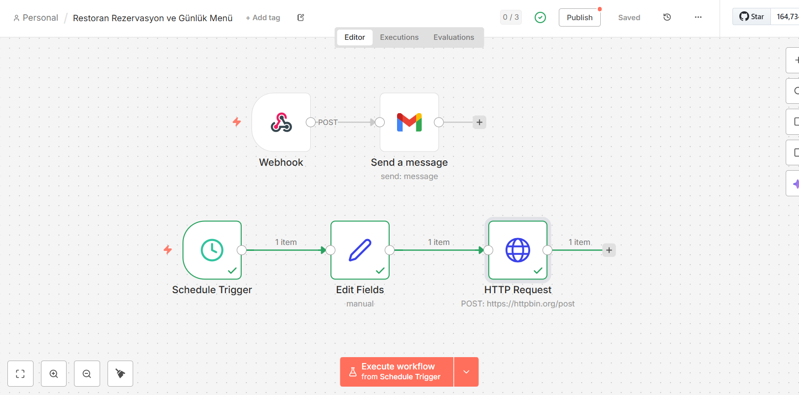
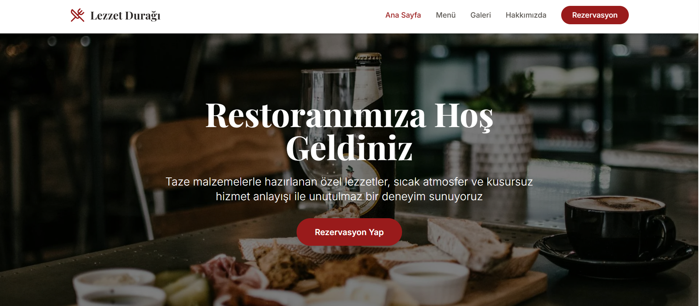
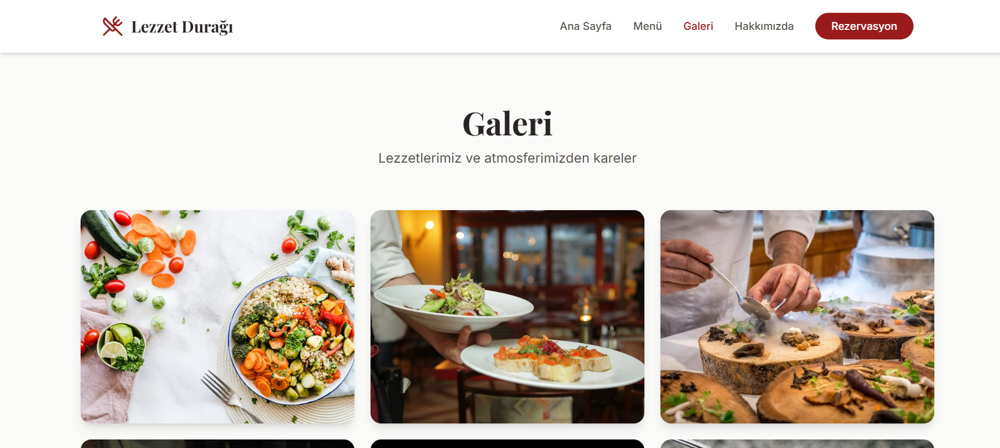
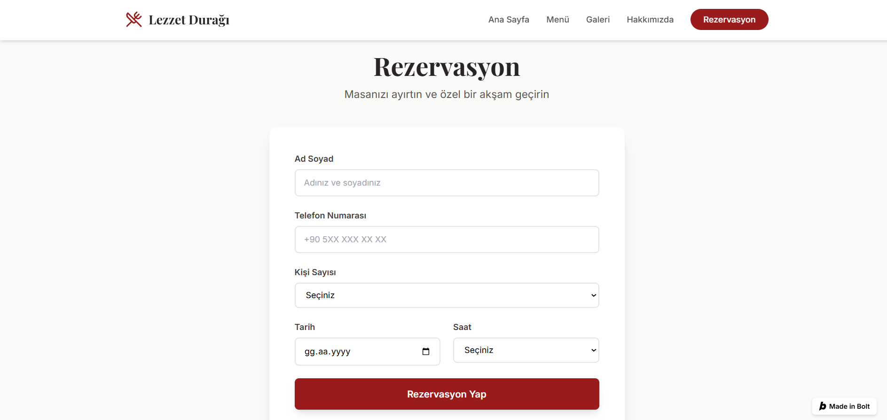

 # Restoran Menü ve Tanıtım Sitesi Projesi  🍽️

Bu proje, bir restoran için rezervasyon alma ve otomatik bildirim sistemini kapsamaktadır.

## 🚀 Proje Özeti
- Web sitesi üzerinden rezervasyon alma
- n8n webhook ile rezervasyon verilerini yakalama
- Rezervasyon detaylarını e-posta ile gönderme
- Günlük menüyü WhatsApp üzerinden otomatik paylaşma (scheduled)

## 🧰 Kullanılan Teknolojiler
- React (Bolt.new)
- n8n
- SMTP (Email)
- WhatsApp API (Mock)

## 📂 Proje Yapısı
- `website/` → Restoran tanıtım ve rezervasyon sitesi
- `n8n/` → Otomasyon workflow dosyaları

## 🔄 n8n Workflows
1. **Rezervasyon Email Workflow**
   - Webhook ile form verisi alır
   - Restoran sahibine e-posta gönderir

2. **Günlük WhatsApp Menü Workflow**
   - Cron ile her gün 09:00’da çalışır
   - Günün menüsünü WhatsApp üzerinden gönderir 

## 📌 Not
WhatsApp entegrasyonu demo/mock olarak hazırlanmıştır.

## 📸 Proje Görselleri

### Ana Sayfa

### Menü Sayfası

### Galeri

### Rezervasyon Formu

